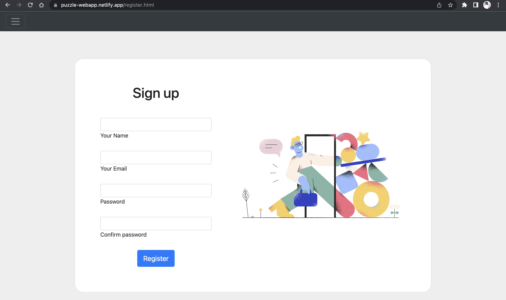
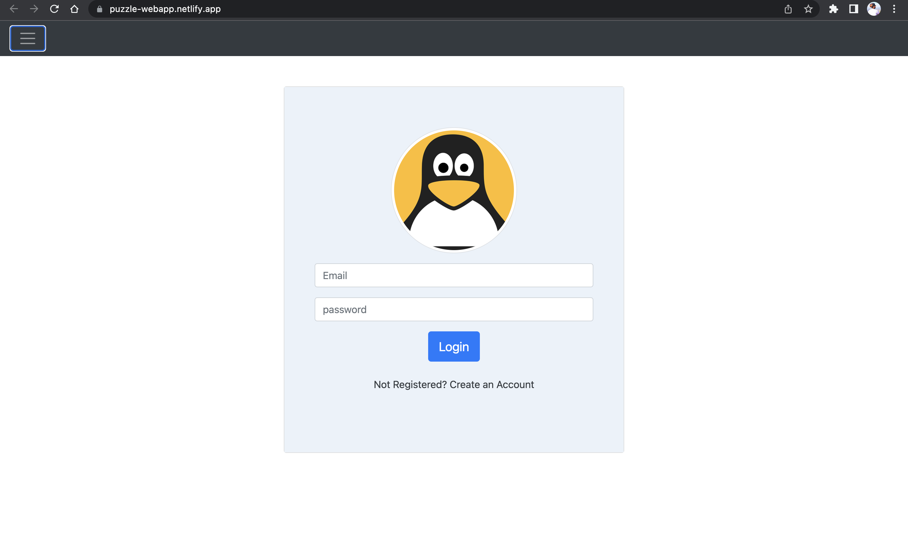
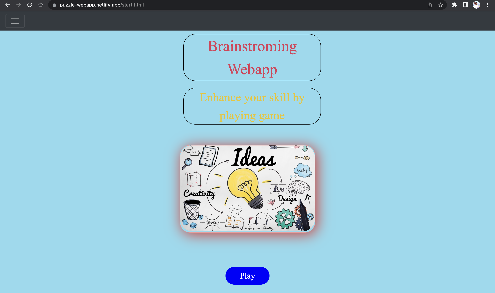
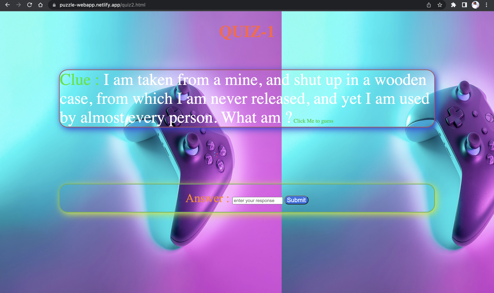
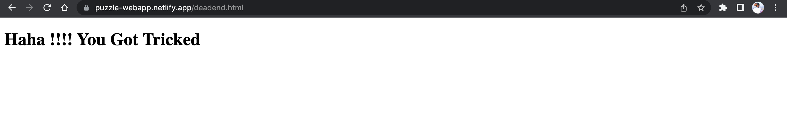

# Puzzle-Webapp
I have developed a brainstorming puzzle web app which involves creating an interactive platform that engages users in solving puzzles and generating ideas. 
The app typically presents users with a variety of puzzles, such as word puzzles or visual puzzles, that require creative and analytical thinking to solve. 
The app may also include features such as hints, and scoring systems to increase user engagement.

# Website Link 
Link : https://puzzle-webapp.netlify.app/

# Description
1. This Puzzle webapp has five levels.  
2. Each Puzzle have hints and clues.   
3. User must guess the right answer to move forward.   
4. It also have some wrong hint which leads to Deadend.   

# How to Use 
1. Firstly user have to SignUp to register themselves.
2. After successsfull registration user will directed to LogIn page.     
3. After entering the credentials user will moved to start page.    
4. Once the user start the game user will directed to Puzzle window.  
5. User should use hints and clues to guess the answer.  
6. User will forwarded to next level only if they pass the prior level.
7. There are some wrong clues are also present which leads to deadend.

# Website Glimpse
Register Page     
      

LogIn Page      
 

Start Page    
 

Puzzle    
 

Deadend   
 

# Languages and Technologies Used
HTML 
CSS  
Javascript 
Firebase 

# Source
Youtube : https://www.youtube.com/    
Javascript Documentation : https://developer.mozilla.org/en-US/docs/Web/JavaScript     
W3Schools : https://www.w3schools.com/       
Firebase Documentation : https://firebase.google.com/docs   
